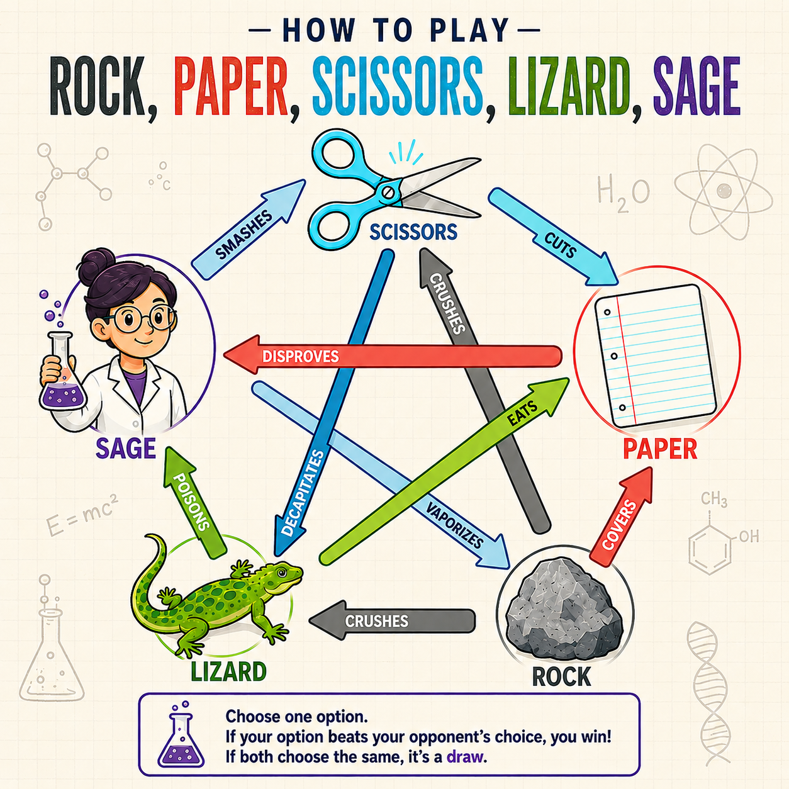

# Rock, Paper, Scissors, Lizard, Sage


> A browser-based twist on the classic Rock Paper Scissors game — expanded to 5 moves, 5 unique AI opponents with distinct play styles, live score tracking, and full audio feedback.

---

## Demo


---

## The Problem

Standard Rock Paper Scissors has only 3 moves and one random computer opponent, making it feel repetitive after a few rounds. There's no strategy, no personality, and no reason to keep playing.

## The Solution

This game expands the ruleset to 5 moves (adding Lizard and Sage), introduces 5 named AI opponents who each favor a different move, and tracks wins, losses, and draws in real time. Opponents switch automatically after a decisive 3-win or 3-loss streak, keeping every session fresh.

---

## Features

- **5-move ruleset** — Rock, Paper, Scissors, Lizard, Sage with all 10 win/loss combinations
- **5 AI opponents with personalities** — each opponent favors one move, making them predictable enough to strategize against
  - Charmin — favors Paper
  - Rocky — favors Rock
  - Cutter — favors Scissors
  - Iggy — favors Lizard
  - Leonard — favors Sage
- **Automatic opponent switching** — after 3 wins or 3 losses in a row, a new opponent is introduced (never the same one twice in a row)
- **Live scoreboard** — Wins, Losses, and Draws update after every round
- **Audio feedback** — unique sounds for win, loss, and draw
- **Result images** — visual win/loss/draw display with timed reset
- **Keyboard support** — Enter key submits, number keys 1–5 select moves instantly
- **Downloadable results** — export full session data as JSON

---

## How to Play

| Input | Move |
|---|---|
| `1` or `p` | Paper |
| `2` or `r` | Rock |
| `3` or `s` | Scissors |
| `4` or `l` | Lizard |
| `5` or `sg` | Sage |

Type your move into the input box and press **Play** or hit **Enter**.

---

## Rules



- Scissors cuts Paper
- Paper covers Rock
- Rock crushes Lizard
- Lizard poisons Sage
- Sage smashes Scissors
- Scissors decapitates Lizard
- Lizard eats Paper
- Paper disproves Sage
- Sage vaporizes Rock
- Rock crushes Scissors

---

## Tech Stack

- **JavaScript (ES6)** — game logic, DOM manipulation, audio, timers
- **HTML5** — semantic markup
- **CSS3** — layout and styling
- **JSON** — score persistence and default data
- **Web Audio API** — preloaded audio with warm-up on first interaction

---

## Project Structure

```
rpsls-game/
├── index.html          # Entry point
├── css/
│   └── style.css       # All styling
├── game/
│   ├── game.js         # Win/loss rules and input parsing
│   ├── opponents.js    # AI opponent definitions and move pools
│   ├── scores.js       # Score tracking and JSON export
│   └── ui.js           # DOM, audio, images, game flow
├── data/
│   ├── default.json    # Starting score template
│   └── results.json    # Live session scores
└── assets/
    ├── images/         # Result and UI images
    └── audio/          # Win, loss, draw sound files
```

---

## Getting Started

No build tools or dependencies required — this runs entirely in the browser.

```bash
# 1. Clone the repo
git clone https://github.com/mcknight-coding/rpsls-game

# 2. Open in browser
open index.html
```

Or simply download the ZIP, extract it, and open `index.html` in any modern browser.

> **Note:** Audio preloading requires the page to be served over a local server or live URL. If opening directly from the file system, audio may be delayed on first play. Use VS Code's Live Server extension or any static file server for best results.

---

## Architecture

```
User Input
    │
    ▼
parsePlayerInput()      ← game.js — validates and maps input to move
    │
    ▼
getOpponentMove()       ← opponents.js — weighted random pick from personality pool
    │
    ▼
decideOutcome()         ← game.js — compares moves against WIN_CONDITIONS table
    │
    ▼
getResultReason()       ← game.js — builds result sentence ("Rock crushes Scissors")
    │
    ▼
showWin/Lose/Draw()     ← ui.js — updates image, text, and plays audio
    │
    ▼
recordMove()            ← scores.js — updates in-memory score store
recordOutcome()
    │
    ▼
updateScoreboard()      ← ui.js — writes updated totals to the DOM
    │
    ▼
checkStreakAndSwitch()  ← ui.js — switches opponent after 3-win or 3-loss streak
```

---

## What I Learned

This project started as a simple browser game and grew into a multi-file JavaScript application. The biggest technical lessons were separating concerns across files (keeping logic, UI, and data in their own modules), managing browser audio preloading constraints, and using JavaScript's `setTimeout` and `clearTimeout` to control timed UI state without race conditions between rounds.

---

## Future Improvements

- [ ] Persistent scoreboard using `localStorage` so scores survive page refresh
- [ ] Player selects their opponent directly instead of random assignment
- [ ] Animated opponent avatars that react visually to win and loss outcomes
- [ ] Difficulty settings — easy opponents favor one move heavily, hard opponents adapt to the player's recent choices
- [ ] Mobile-friendly layout with tap buttons replacing text input
- [ ] Sound toggle button for players who prefer no audio
- [ ] Match history log showing the last N rounds with move and result

---

## License

MIT © Aaron McKnight
